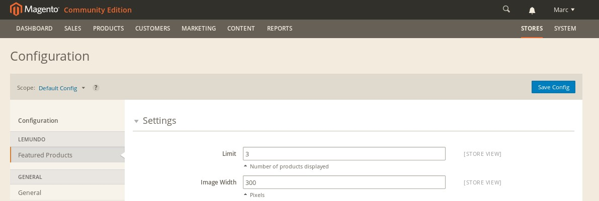
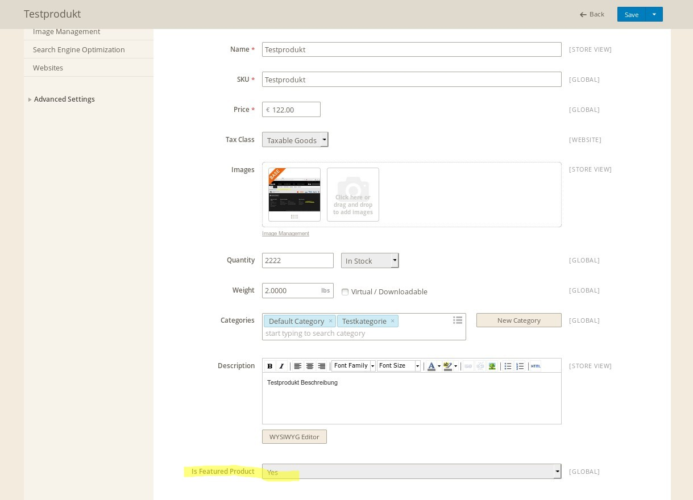

## Documentation for mage2Modules/featuredProducts

### First words

This module was created during our monthly hackathon at Lemundo (http://www.lemundo.de) to get comfortable with Magento2.
Since Magento2 is still in the early beta, use it at your own risk. No guarantee from our side ;)

### Purpose of this module

The module creates a new boolean product attribute which you can set to Yes/No at the product.
All products which are set to Yes are featured products.
They will be shown in a custom block of this module, which you can include within a CMS file using: 
```{{block class="Lemundo\FeaturedProducts\Block\ProductList" template="list.phtml"}}```
or in the XML via ```<block class="Lemundo\FeaturedProducts\Block\ProductList" name="lemundo.featured.list" as="featured" before="-" template="list.phtml"/>```

### Backend configuration

There are two possible settings in the backend under the group "Featured Products" in the system configuration.
You can set a limit of products which is the maximum number of featured products shown inside the block (they are randomized, Default: 3).
And you can set the width of the product image in pixels (Default: 300).

See screenshot:



When you edit a product, the new attribute will be visible in the "Product Details" group at the very bottom.
By default it is set to No for all products. Set it to Yes for your featured products as shown in the screenshot and save the product:



### Installation

You can install this module in three ways:

* a) Copy the folder app/ into your magento2 store
* b) Using modman: modman init followed by modman clone /url/to/this/repository
* c) Using composer: Add the module to your composer.json file

After either of theses three ways, you need to activate the module by editing your app/etc/config.php file:

  ```
  ...
  'modules' => 
  array (
    'Lemundo_FeaturedProducts' => 1,
    ...```

Afterwards, make sure that Magento installs the new attribute by running: ```php setup/index.php update```

### Authors

* Michael Timm
* Marc Päpper (https://twitter.com/mpaepper)